# 🛍️ Araadia Clothing Store - Final Deliverable 🎉

Welcome to the Araadia Clothing Store Final Deliverable repository! This repository documents the comprehensive project work done by "The Eliminators" - Areeba Sattar, Saad Khan, and Maria Saeed as part of CS3009 - Software Engineering in Spring 2023.

## 📜 Project Overview

This deliverable presents the culmination of our efforts in developing the Araadia Clothing Store. It includes detailed artifacts and documentation related to the project's software design, architecture, sprints, and more.

### 📂 Contents

1. **Software Project Plan**
   - Work Breakdown Structure
     
     
   - Project Gantt Chart
     
     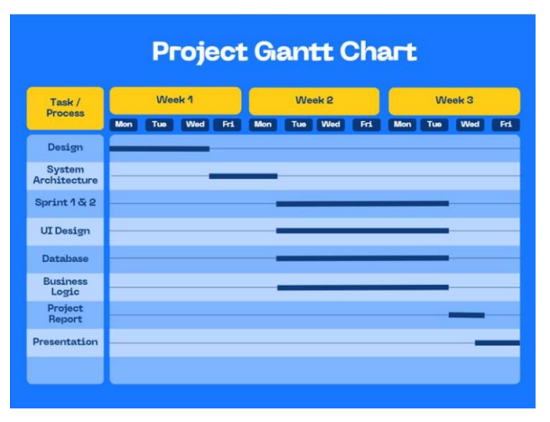
   - System Architecture
     - Subsystems
       
      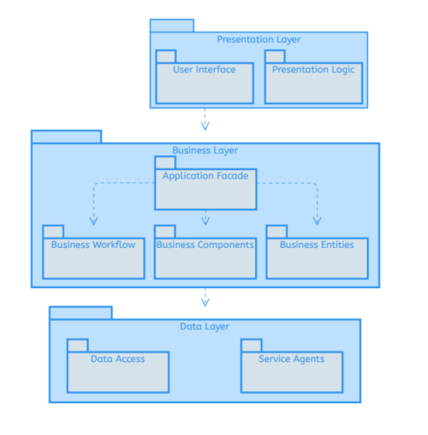
     - Architectural Style
       - Layered Architectural Style
         
        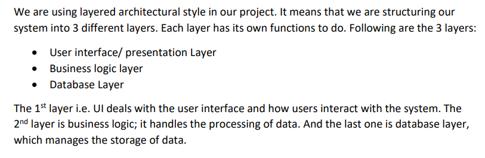
     - Deployment Diagram
       
       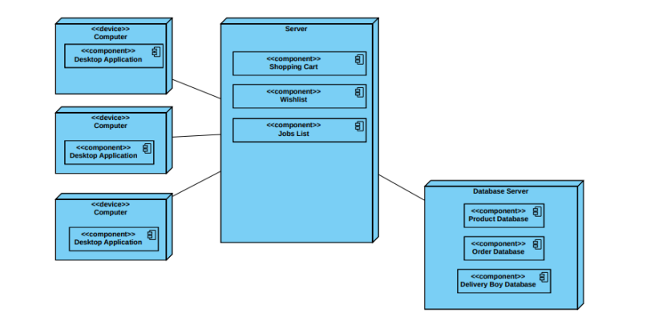
     - Component Diagram
       
       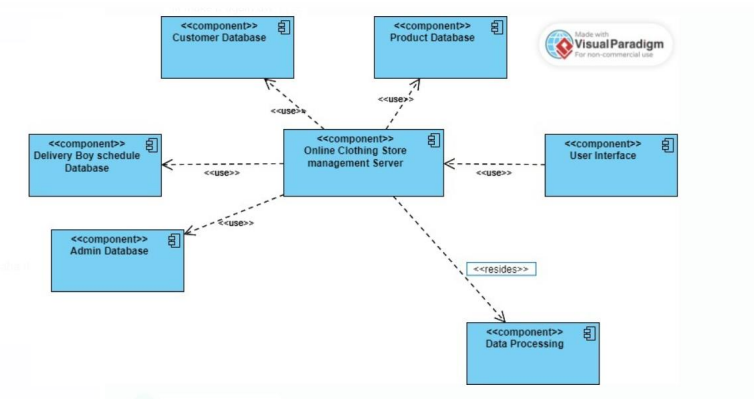

2. **Design**
   - Use Case Diagram
     
     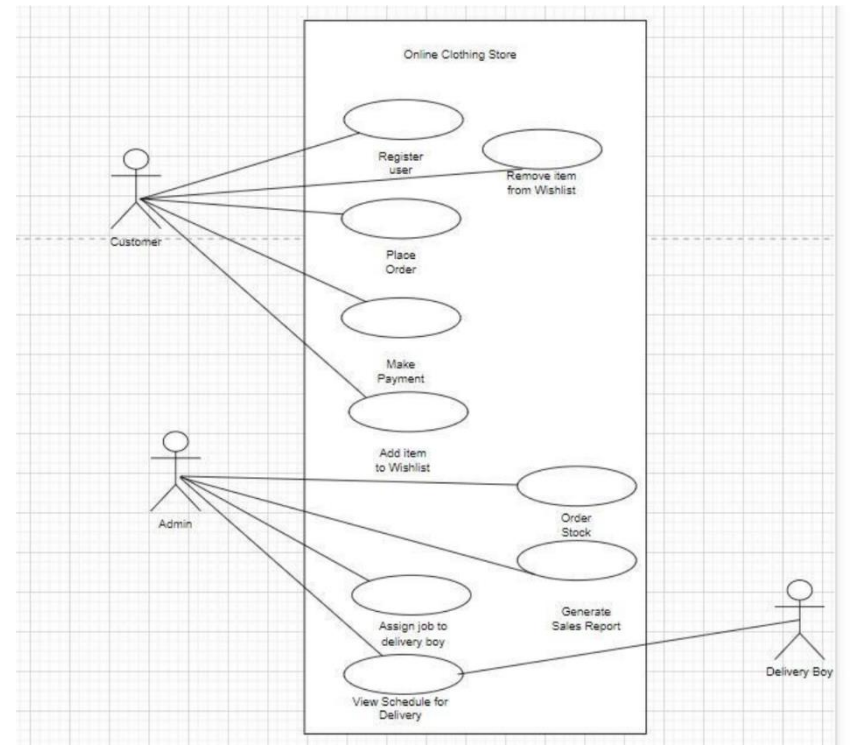
   - Sequence Diagrams
     - Activity 1 -> Register User
       
       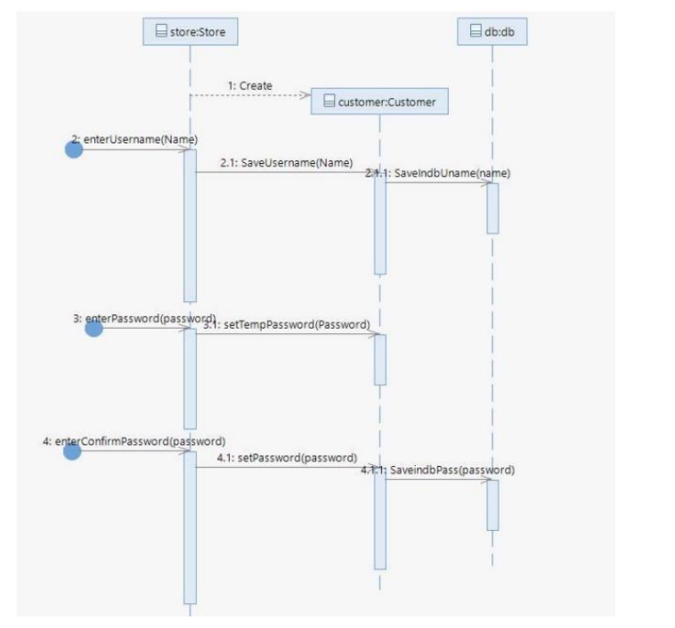
     - Activity 2 -> View Stock
       
       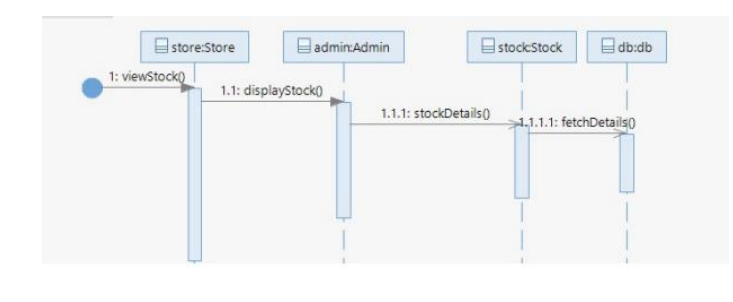
     - Activity 3 -> Search item
       
       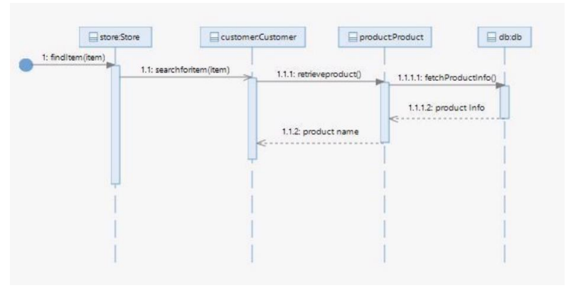
   - Class Diagram
     
     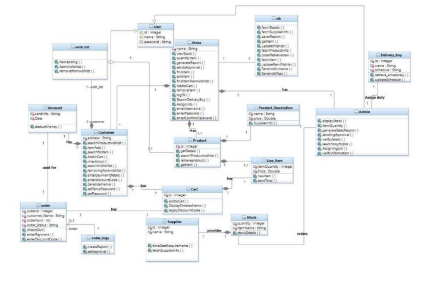

3. **Sprint 1**
   - Sprint Backlog

     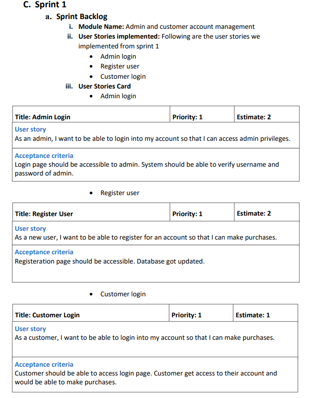
   - Scrum Board Snapshots
     
     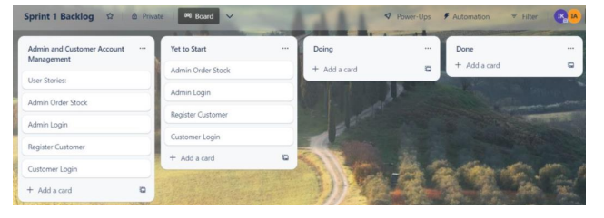
     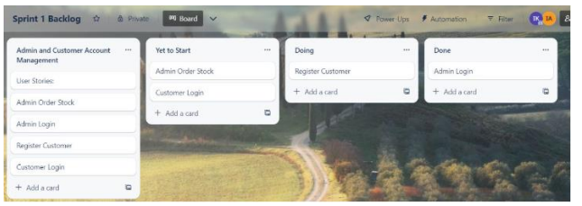
     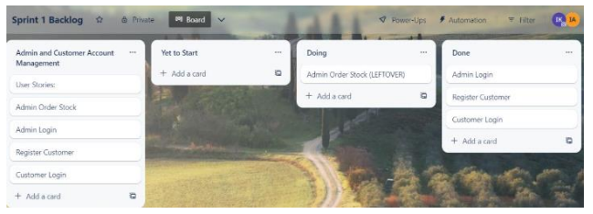
   - Burn-down Chart
     
     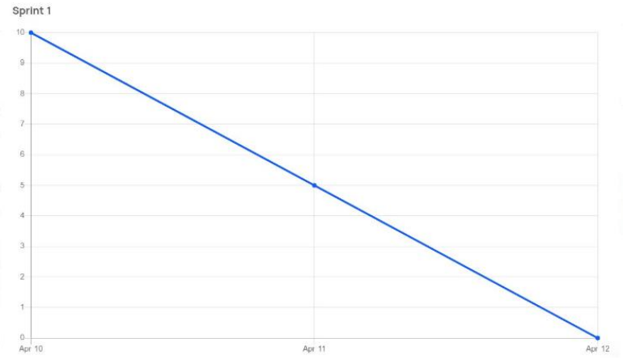

4. **Sprint 2**
   - Sprint Backlog
     
     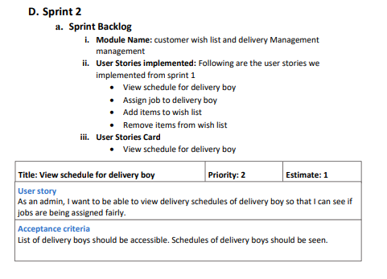
     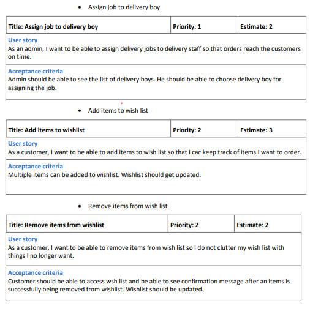
   - Scrum Board Snapshots
     
     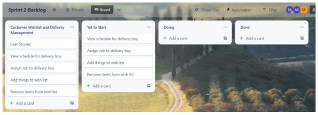
     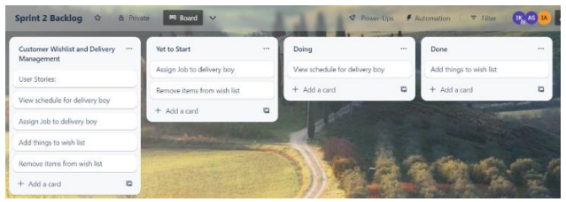
     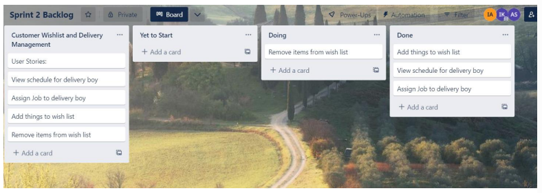
   - Burn-down Chart
     
     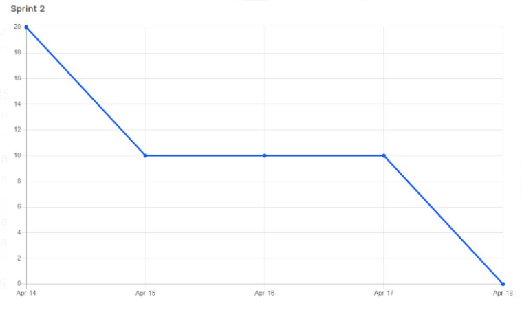

## 🚀 Get Involved

Feel free to explore the various artifacts and documents included in this repository. We welcome your feedback and collaboration. For any inquiries, please contact us.

## 🙌 Acknowledgements

We would like to express our gratitude to our instructors and mentors who guided us throughout this project. Your support has been invaluable.

